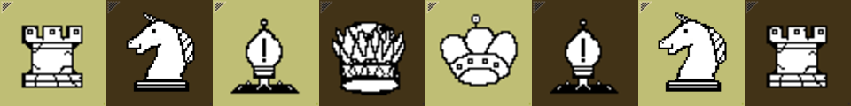

# Collider



A small UCI chess engine in C++.

Modernized from a version written in 2014 (!!)
One of my first software projects. 
I have learned a lot since then and thought it would be interesting to
capture the progress with a somewhat better designed engine.

With the advent of AI tools, personal software development projects seem rather mundane. 
Bespoke, handcrafted, artisanal code

## Build

Needs a C++17 compiler, CMake, [Armadillo](https://arma.sourceforge.net/), and SDL2.

```sh
cmake -S . -B build -G Ninja -DCMAKE_BUILD_TYPE=Release -DENABLE_GUI=OFF
cmake --build build
```

The binary lands in `build/bin/collider`.

## Usage

```sh
collider            # UCI mode (for chess GUIs / engine matches)
collider --cli      # play from the command line
collider --help     # options
```

## License

[MIT](LICENSE)
